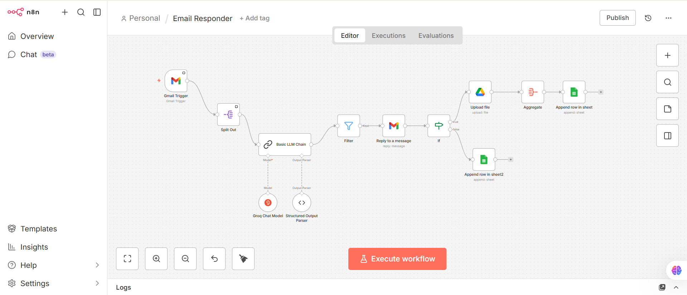

# Context-Aware-Email-Responder-Automation
An intelligent email automation workflow built with n8n that automatically detects software product complaints, generates AI-powered responses, and logs structured complaint data for tracking and analysis.

## 🚀 Overview
This workflow monitors incoming emails, identifies product-related complaints (application errors, accuracy issues), responds professionally using an LLM, stores complaint screenshots in Google Drive, and logs sender details in Google Sheets.
It transforms unstructured customer emails into structured, actionable feedback data.

## 🖼️ Workflow Architecture

  

## 🛠️ Tech Stack
n8n – Workflow automation

LLM (Groq - LLaMA 3.3 70B) – Email classification & response generation

Gmail API – Email monitoring & replies

Google Drive API – Screenshot storage

Google Sheets API – Structured complaint logging

## ⚙️ Workflow Process
Gmail Trigger monitors incoming emails.
### LLM Chain:
Classifies if the email is a product complaint.
Extracts sender details.
Generates a professional reply.
Conditional Filter ensures only valid product complaints are processed.
Automated Reply is sent to the customer.
### Attachment Handling:
Screenshots are uploaded to Google Drive.
Data Logging:
Sender name, email, complaint content, date, and image reference are stored in Google Sheets.

## 📊 Key Features
AI-based complaint detection
Automated, empathetic email responses
Screenshot archiving in cloud storage
Structured complaint tracking system
Fully automated end-to-end workflow

## 📌 Use Case
Designed for software product teams to:
Reduce manual support effort
Improve response time
Track recurring product issues
Centralize complaint management
